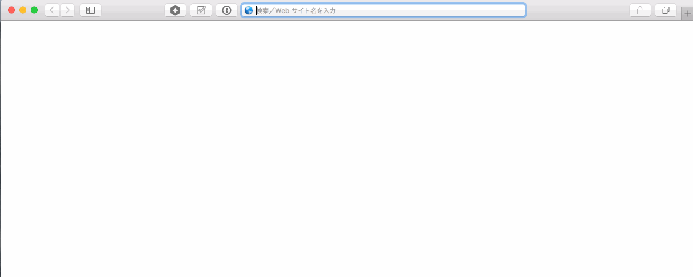
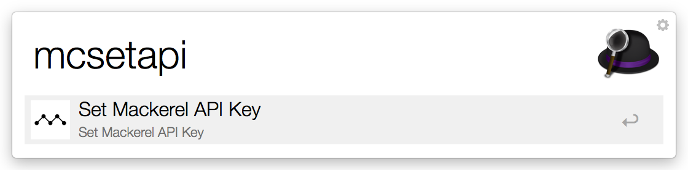
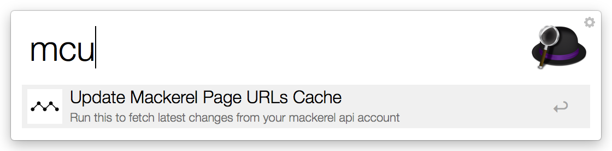
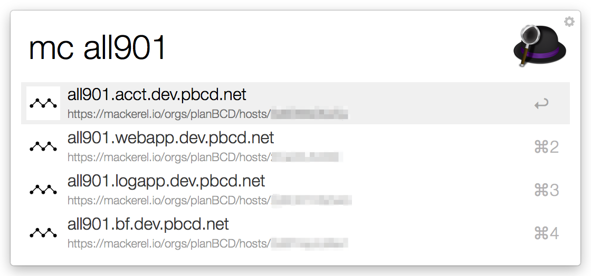
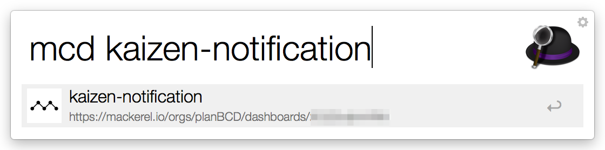
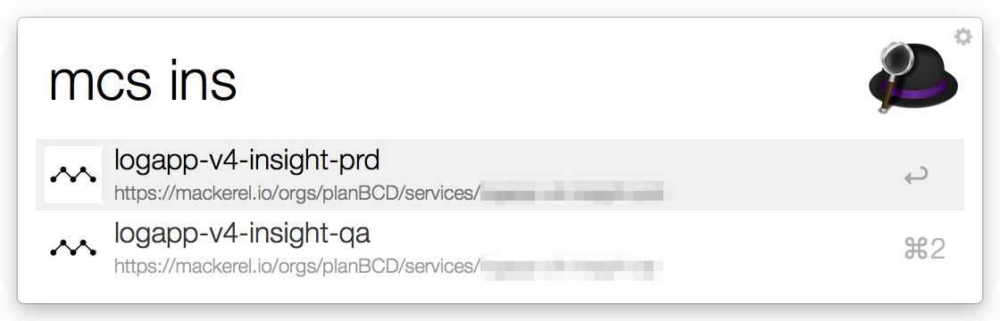

# alfred-mackerel-page-workflow

## これは何?

[Mackerel](https://mackerel.io/) で

  * Host
  * Dashboard
  * Service

のページを簡単に開くことが出来るAlfred Workflowです

## インストール方法

下記URLから`Mackerel.Page.Workflow.alfredworkflow` をダウンロードし、Alfredにインストールしてください。

 * https://github.com/glidenote/alfred-mackerel-page-workflow/releases

## APIキーとオーガニゼーションの設定

`mcapiset` を実行すると、テキストエディットが設定ファイルを開くので、

 * APIキー (読み取り権限)
 * オーガニゼーション

を設定してください

**テキストエディットでファイル編集中にクオート、ダブルクオートが勝手に書き換えてられてしまうことがあるらしいのでご注意ください**

 * [Macで引用符を入力すると勝手に変換されるのをやめたい - PILOG](http://xoyip.hatenablog.com/entry/2014/01/06/205101)
 * [Mac のダブルクォーテーションが勝手に変換される問題の対処法 - 強火で進め](http://d.hatena.ne.jp/nakamura001/20140506/1399363317)

## URL情報を取得

`mcu` を実行すると、API経由で、URL情報を取得し、キャッシュファイルに保存します。

## Hostページの開く

`mc {hostname}` を実行すると、該当hostのメトリクスページが開きます。

## Dashboardページを開く

`mcd {dashboard}` を実行すると、該当Dashboardページを開きます。

## Serviceページを開く

`mcs {service}` を実行すると、該当Serviceページを開きます。

